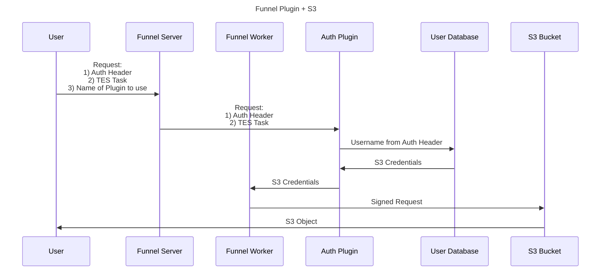

[](https://github.com/ohsu-comp-bio/funnel-plugins/actions/workflows/tests.yaml)
[](LICENSE)
[](https://github.com/ohsu-comp-bio)

</div>

# Overview ⚙️

> [!NOTE]
> Adapted from Hashicorp's [gRPC KV Plugin example](https://github.com/hashicorp/go-plugin/tree/main/examples/grpc) and [RPC-based plugins in Go](https://eli.thegreenplace.net/2023/rpc-based-plugins-in-go/) by [Eli Bendersky](https://eli.thegreenplace.net) ([@eliben](https://github.com/eliben)) 🚀

This repo contains Funnel Plugin development using the [`go-plugin`](https://github.com/hashicorp/go-plugin) package from [HashiCorp](https://github.com/hashicorp).

In this setup, the Plugin handles all user authentication, with the Server having no knowledge or record of specific user credentials/tokens.

# Quick Start ⚡

## 1. Build the Plugin and Test Server

First build and run the test User Database server:

```console
➜ git clone https://github.com/ohsu-comp-bio/funnel-plugins

➜ cd funnel-plugins

➜ make
```

> [!TIP]
> This will create three executable binaries in the `build` directory:
>
> | Executable           | Description                                                                  |
> | -------------------- | ---------------------------------------------------------------------------- |
> | `cli`                | the "application" used for invoking the plugin binary                        |
> | `test-server`        | the Test Server used for storing user and credentials (called by the plugin) |
> | `plugins/authorizer` | the plugin binary                                                            |

## 2. Start the Test Server 

```sh
➜ ./test-server
Server is running on http://localhost:8080
```

## 3. Test Authorized User

Then in another terminal window, invoke the CLI component to authenticate a user named `example` who is an `Authorized` user (i.e. found in the "User Database" — [`example-users.csv`](./tests/example-users.csv)):

```sh
➜ ./build/cli example
{
  "code": 200,
  "message": "User found!",
  "config": {
    "Key": "key1",
    "Secret": "secret1"
  }
}
```

## 4. Test Unauthorized User

Attempt to authenticate a user named `error`, representing an `Unauthorized` user:

```sh
➜ ./build/cli error
{
  "code": 401,
  "message": "User not found"
}
```

# Architecture 📐

This repo contains the following major components:

1. [Plugin](https://github.com/ohsu-comp-bio/funnel-plugins/blob/main/plugin/auth_impl.go) — the actual plugin itself, makes calls to the external User Database Service
2. [CLI](https://github.com/ohsu-comp-bio/funnel-plugins/blob/main/main.go) — the helper program that allow users to run the plugin from the command line
3. [Test Server](https://github.com/ohsu-comp-bio/funnel-plugins/blob/main/tests/test-server.go) — the mock User Database Service to store the users and their tokens/credentials

# Sequence Diagram 📝



# Additional Resources 📚

- https://github.com/hashicorp/go-plugin
- https://pkg.go.dev/github.com/hashicorp/go-plugin
- https://eli.thegreenplace.net/2023/rpc-based-plugins-in-go
- https://github.com/eliben/code-for-blog/tree/main/2023/go-plugin-htmlize-rpc
