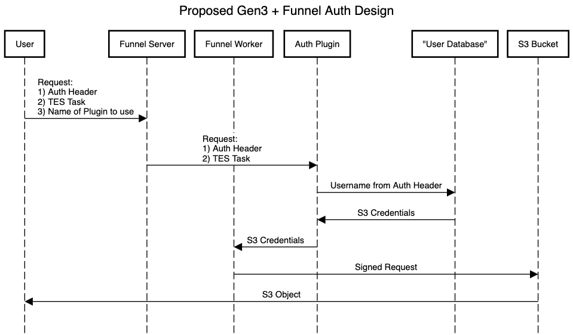

[](https://github.com/ohsu-comp-bio/funnel-plugins/actions/workflows/tesrs.yaml)
[](LICENSE)
[](https://github.com/ohsu-comp-bio)

</div>

# Overview ⚙️

> [!NOTE]
> Adapted from Hashicorp's [gRPC KV Plugin example](https://github.com/hashicorp/go-plugin/tree/main/examples/grpc) 🚀

This repo contains Funnel Plugin development using the [`go-plugin`](https://github.com/hashicorp/go-plugin) package from [HashiCorp](https://github.com/hashicorp).

In this setup, the Plugin handles all user authentication, with the Server having no knowledge or record of specific user credentials/tokens.

# Quick Start ⚡

## 1. Start the Test Server 

```console
➜ git clone https://github.com/ohsu-comp-bio/funnel-plugins

➜ cd funnel-plugins

➜ make test-server

➜ ./test-server
Server is running on http://localhost:8080
```

## 2. Build the Plugin

```sh
➜ make

➜ export FUNNEL_PLUGIN=./authorizer-plugin
```

## 3. Test Authorized User

Invoke the CLI component to authenticate a user named `example` who is an `Authorized` user (i.e. found in the "User Database" — [`example-users.csv`](./tests/example-users.csv)):

```sh
➜ ./authorizer example
{
  "token": "example's secret",
  "user": "example"
}
```

## 4. Test Unauthorized User

Attempt to authenticate a user named `error`, representing an `Unauthorized` user:

```sh
➜ ./authorizer error
{
  "error": "user 'error' not found"
}
```

# Architecture 📐

This repo contains the following major components:

1. [Plugin](https://github.com/ohsu-comp-bio/funnel-plugins/blob/main/plugin/auth_impl.go) — the actual plugin itself, makes calls to the external User Database Service
2. [CLI](https://github.com/ohsu-comp-bio/funnel-plugins/blob/main/main.go) — the helper program that allow users to run the plugin from the command line
3. [Test Server](https://github.com/ohsu-comp-bio/funnel-plugins/blob/main/tests/test-server.go) — the mock User Database Service to store the users and their tokens/credentials

# Sequence Diagram 📝

> Created with https://sequencediagram.org ([_source_](https://github.com/ohsu-comp-bio/funnel/blob/feature/plugins/plugins/sequence-diagram.txt))



# Additional Resources 📚

- https://github.com/hashicorp/go-plugin
- https://pkg.go.dev/github.com/hashicorp/go-plugin
- https://eli.thegreenplace.net/2023/rpc-based-plugins-in-go
- https://github.com/eliben/code-for-blog/tree/main/2023/go-plugin-htmlize-rpc
