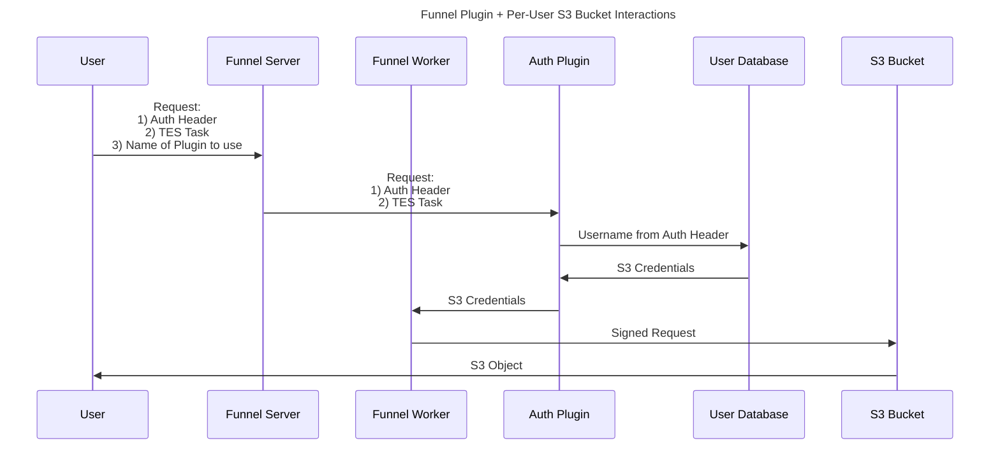

[](https://github.com/ohsu-comp-bio/funnel-plugins/actions/workflows/tests.yaml)
[](LICENSE)
[](https://github.com/ohsu-comp-bio)

</div>

# Overview ⚙️

> [!NOTE]
> Adapted from Hashicorp's [gRPC KV Plugin example](https://github.com/hashicorp/go-plugin/tree/main/examples/grpc) and [RPC-based plugins in Go](https://eli.thegreenplace.net/2023/rpc-based-plugins-in-go/) by [Eli Bendersky](https://eli.thegreenplace.net) ([@eliben](https://github.com/eliben)) 🚀

This repo contains Funnel Plugin development using the [`go-plugin`](https://github.com/hashicorp/go-plugin) package from [HashiCorp](https://github.com/hashicorp).

In this setup, the Plugin handles all user authentication, with the Server having no knowledge or record of specific user credentials/tokens.

# Quick Start ⚡

## 1. Build the Plugin and Test Server

First build and run the test User Database server:

```console
➜ git clone https://github.com/ohsu-comp-bio/funnel-plugins

➜ cd funnel-plugins

➜ make
```

> [!TIP]
> This will create three executable binaries in the `build` directory:
>
> | Executable           | Description                                                                  |
> | -------------------- | ---------------------------------------------------------------------------- |
> | `cli`                | the "application" used for invoking the plugin binary                        |
> | `test-server`        | the Test Server used for storing user and credentials (called by the plugin) |
> | `plugins/authorizer` | the plugin binary                                                            |

## 2. Start the Test Server 

```sh
➜ ./test-server
Server is running on http://localhost:8080
```

## 3. Test Authorized User

Then in another terminal window, invoke the CLI component to authenticate a user named `example` who is an `Authorized` user (i.e. found in the "User Database" — [`example-users.csv`](./tests/example-users.csv)):

```sh
➜ ./build/cli example
{
  "code": 200,
  "message": "User found!",
  "config": {
    "Key": "key1",
    "Secret": "secret1"
  }
}
```

## 4. Test Unauthorized User

Attempt to authenticate a user named `error`, representing an `Unauthorized` user:

```sh
➜ ./build/cli error
{
  "code": 401,
  "message": "User not found"
}
```

# Architecture 📐

This repo contains the following major components:

1. [Plugin](https://github.com/ohsu-comp-bio/funnel-plugins/blob/main/plugin/auth_impl.go) — the actual plugin itself, makes calls to the external User Database Service
2. [CLI](https://github.com/ohsu-comp-bio/funnel-plugins/blob/main/main.go) — the helper program that allow users to run the plugin from the command line
3. [Test Server](https://github.com/ohsu-comp-bio/funnel-plugins/blob/main/tests/test-server.go) — the mock User Database Service to store the users and their tokens/credentials

# Sequence Diagram 📝



# Authoring Plugins ✍️

## Overview 🌀

The following includes examples and resources for writing Plugins (in Go, Python, or any other [supported language](https://grpc.io/docs/languages/)!)
 
- [gRPC Example](https://github.com/hashicorp/go-plugin/tree/main/examples/grpc) (this is largely what Funnel Plugins is based off of, along with this [manager](https://github.com/eliben/code-for-blog/blob/main/2023/go-plugin-htmlize-rpc/plugin/manager.go#L28-L83) snippet by [Eli Bendersky](https://eli.thegreenplace.net/2023/rpc-based-plugins-in-go/) for loading the plugin binaries)
 
- [Intro](https://github.com/hashicorp/go-plugin/blob/main/docs/extensive-go-plugin-tutorial.md) (super helpful reference from beginning to end)

## Communicating with Funnel

> [!WARNING]
> TODO: Add the following to the docs 🚧
> - API "contract" between the Plugin and Funnel Server":
>   - What exactly will the Plugin require for inputs and outputs (`Config`)?
>   - What functions will plugin authors need to implement (e.g. `Get`)?

### Inputs

```go
User string
```

### Outputs

```go
config.Config
```

### Functions

```go
Authorize.Get()
```

## Python 🐍

- [Writing Plugins Without Go](https://github.com/hashicorp/go-plugin/blob/main/docs/guide-plugin-write-non-go.md) (written by Mitchell Hashimoto one of the original co-founders of Hashicorp along with Armon Dadgar! :exploding_head:) (edited) 

## gRPC + Protobuf ️🚀

> [!TIP]
> Understanding gRPC and protobufs isn't necessary to writing plugins, but it can be helpful when errors or bugs arise 🐛

Under the hood, all communication between the Plugin and the Funnel Server happens over gRPC using Protocal Buffers (*protobufs*).

- [Protobuf Overview](https://protobuf.dev/)
  
- Tutorials for [Go](https://protobuf.dev/getting-started/gotutorial/) and [Python](https://protobuf.dev/getting-started/pythontutorial/)
 
- [Awesome gRPC](https://github.com/grpc-ecosystem/awesome-grpc#protocol-buffers) — pretty up-to-date resource for all things Protobuf and gRPC! 😎
# Additional Resources 📚

- https://github.com/hashicorp/go-plugin
- https://pkg.go.dev/github.com/hashicorp/go-plugin
- https://eli.thegreenplace.net/2023/rpc-based-plugins-in-go
- https://github.com/eliben/code-for-blog/tree/main/2023/go-plugin-htmlize-rpc

